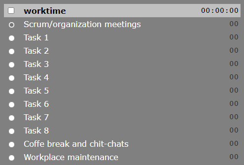

Stopwatch - simple timesheet application
========================================

Stopwatch is simple timesheet interface application. It makes timeshet controll easy
to note work time on different tasks. It is specially designed for users who often 
switches activity during work day.

## Purpose

When working for different copmapies, I have to write information about time spent on various tasks and store this informations in differnt programs. In most complex case i know from my own experience, the time have to be stored in 3 differnt systems used for work time balance, task complexity statistics and for bookkeeping. Additionally, working from home and having up to 3 breaks in worktime, I need a piece of paper to denote when I am starting and stopping my work duties. It was complex, and during pre-realease time, It was hasd to note all data and the timeseet were filled afterward making them less reliable.

I was thinking about simple tool allowing to note worktime without overhead of different interfaces and without the need to calculate time manually. Stopwatch is the result.

I planned to store data directly in time booking programs I was working with, but it seems not to be easy to allow interaction with all posible (or at least popular) systems, where worktime can be stored, si I decided to make standalone application which stores data in json files. Such files can be easity read and process by simple scripts which can transform th data to needed form. 

## Getting started

To start using timesheet stopwatch just start its web server. You can do it from command line or prepare configuration of a service. Starting from command line is easy:

>`python timesheet-server.py`

To open timesheet in web browser - just type its address in adres bar:

>`http://localhost:8483/`

Browser window content should look like

When shitching on checkbox in left upper corner - worktime starts running. Switching taks can be made by switching radio buttons in left column or by clicking task name. 

## Storing time for different employees

Single timesheet stopwatch web server can serve many users at the same time. Just add the username to the url to track additional employee worktime. 

> `http://localhost:8483/wgan`

Opens timesheet interface for user _wgan_

## Define task lists

Task lists should be defined in json file. This file is used when timesheet is requested first time for given day and employee id. File can be defined for given employee id as

>`default-_username_.json`

If such file does not exist, tasklist is taken from global task definition

>`global-default.json.json`

File should have structure:

>`{ "task_list": [ { "name":` _task_name_ } ... ]  ...  }`

Files with default task list can contain any additional data.

## Editing time

It happens pretty often, that you forgot th start stopwatch, when starting work, and numbers need to be changed. To change value, clink on the time corresponding to given task and displayed in right column. Edit box appear and allow to set value. 

Pressing <Enter> accept the value and update time. If entered value is not possible to convert to time duration - time is not changed. Also clicking elsewere to change current task or start/stop count in time checkbox - works as <Enter> key.

To abandon changes - press <Esc>

Allowed time formats are
- XX - number of seconds
- XX:XX - number of minutes and seconds
- XX:XX:XX - number of hours, minutes and seconds
- XXy
- list of values separated by space

where:
- X is digit 0..9
- y denotes type of value: s - for seconds, m - for minutes, h - for hours and d - for days.

## Format of output file

[to be displayed]

## Web server parametrization

When starting web server, some parameters could be passed as program configuration:
- "-p" or "--port" - port server is listening on (default is 8483)
- "-i" or "--ip" - ip of the interface server is listening on (by default all interfaces are selected)
- "-s" or "--storage" - directory where timesheet json files are stored

## To Do

In future releases you can expect
- Possibility to add or substract time gom task by typing time prefixed by '+' or '-'.
- Preserving other fields from default .json denoted object

## Old part of document - to be removed

Stopwatch is simple webserver written in python. To access timesheet interface, open page:
<HOST>:8080/<USERNAME>, where <host} is the host you run web_server.py. <USERNAME> is 
the id of the timeseet user. Users do not need to be registered. When data for the user 
does not exist, default data are provided. 

All data are stored in ordinary json files. File name contain date of timesheet and user id: 
<YYYY-MM-DD>-<USERNAME>.json. When file does not exist - it is created based on "default-<USERNAME>.json"
or "global-defauld.json", if user specific default file does not exist.

Each change of data in interface is reflected in stored files. Files are not deleted by the 
stopwatch server. 

Data file format is simple, but some information might be important if you want to use timesheet data
in your application.
- Time is denoted and count of seconds.
